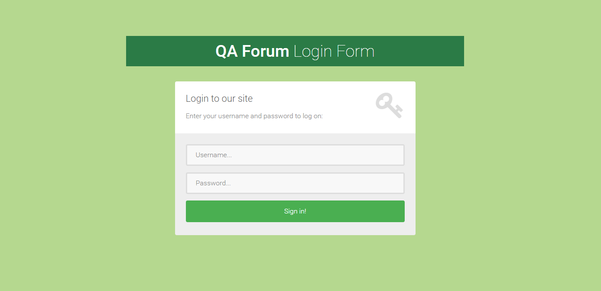
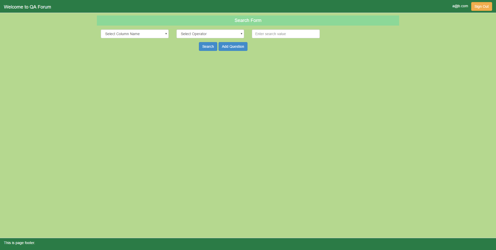
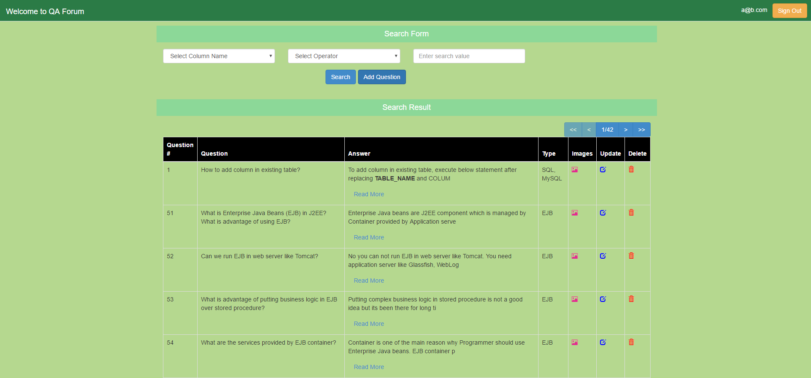
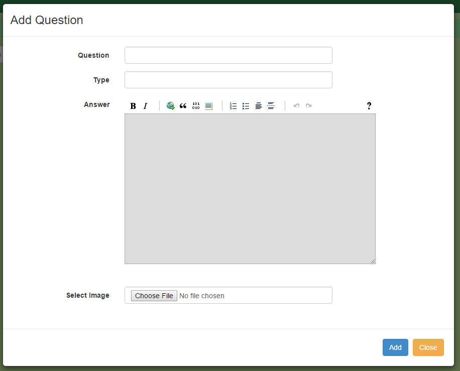
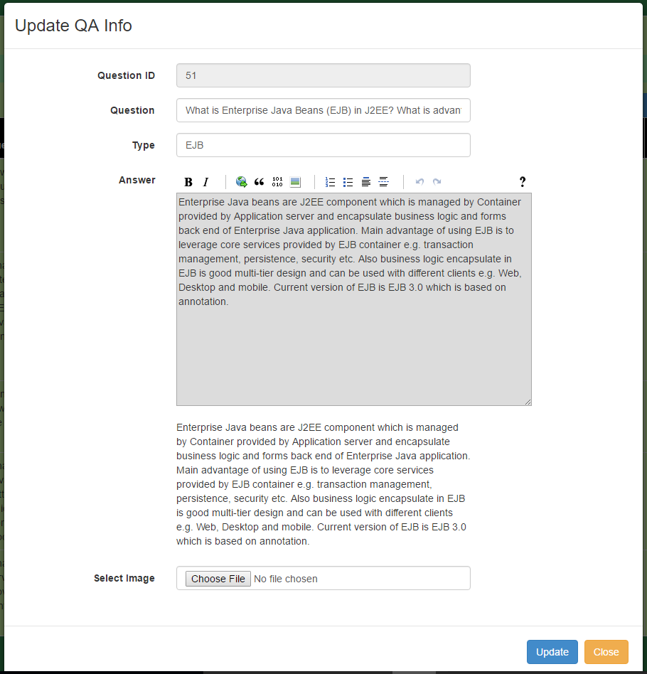
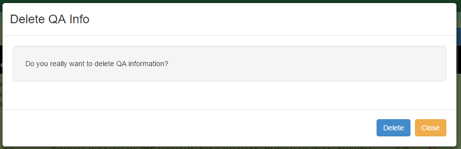
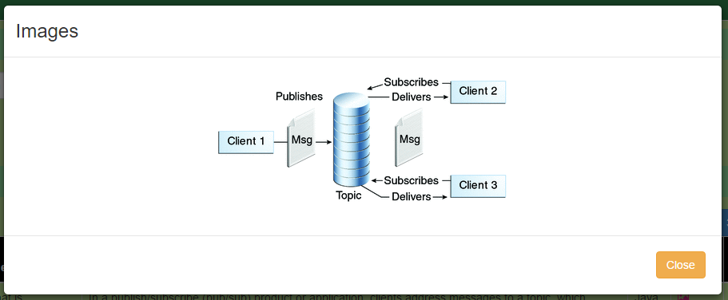

# QA Forum
<ol>
  <li>
    <b>Objective</b>
     
    

      QA Forum is a website which allows user to add/update/delete question. He/she can format the answer with MarkDown editor. Also, he/she can attach image(s) with the particular answer. Currently all questions and answers have no relation with the user. However, it is in pipeline to allow users to save their favorite questions, publish the questions and answers to other users and allow commenting on shared QA.
    

  </li>
  <li>
    <b>Technology</b>
     
    

      The Front-End is designed by using HTML5, Bootstrap 3 and AngularJS. UI communicates with server via RESTful service. To talk to DB, we have used hibernate. For Backend, we have used MySQL. However, we can change it anytime as we are using hibernate and provides facility to easily migrate to another data base.
    

  </li>
  <li>
    <b>Configuration</b>
     
    

      Following are the points to remember while setting up the project:
      <ul>
        <li>
          Add/uncomment below property in hibernate.cfg.xml file:
          <ul>
            <li><property name="hbm2ddl.auto">create</property></li>
          </ul>
        </li>
        <li>Change the connection.url, username, password if needed</li>
        <li>If you have database other than MySQL, then you would need to change driver class and dialect. Also, you will need to add the that database’s connector dependency in pom.xml</li>
        <li>start MySQL server by using below command:
          <ul>
            <li>Go to mysql server folder</li>
            <li>bin\mysqld.exe</li>
          </ul>
        </li>
        <li>You would need to create database in MySQL by using below command:
          <ul><li>Create database qadb</li></ul>
        </li>
        <li>Also, you would need to create sequence table with two columns SEQ_NAME and SEQ_COUNT as currently I have not configured it in hibernate. Will update it soon.</li>
      </ul>
    

  </li>
  <li>
    <b>Tools & Software</b>
     
    

      <ul>
        <li>JDK 1.7</li>
        <li>MySQL 5</li>
        <li>Eclipse IDE</li>
        <li>Apache Maven</li>
        <li>MySQL Workspace Editor(Optional)</li>
      </ul>
    

  </li>
  <li>
    <b>Features</b>
     
    

      <ul>
        <li>Login</li>
        <li>Logout</li>
        <li>Add Question</li>
        <li>Update Question</li>
        <li>Delete Question</li>
        <li>Add/Update Images to Question</li>
        <li>Search Question based on different attributes</li>
        <li>View images associated with QAs</li>
        <li>Import QAs from excel sheet</li>
        <li>Export QAs to excel sheet</li>
      </ul>
    

  </li>
  <li>
    <b>Snapshots</b>
     
    

      
       
      
       
      
       
      
       
      
       
      
       
      
       
    

  </li>
</ol>
